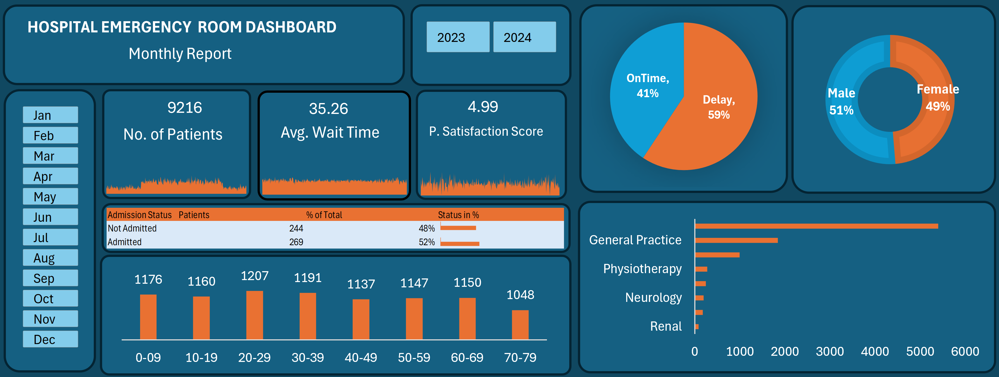

# 🏥 Hospital Emergency Room Analytics | Excel + Power Query

> **Interactive healthcare operations dashboard for patient flow, waiting time, satisfaction, admissions, referrals, and service efficiency.**


## 📊 Project Overview

This project analyzes **9,216 Emergency Room patient visits** and converts patient-level operational data into an interactive Excel dashboard for management-focused reporting.

The project combines **Power Query for data transformation and normalization** with Excel analysis, PivotTables, interactive filters, charts, and KPI reporting.

### Business Flow

`Raw Healthcare Data → Power Query → Clean & Structured Data → Excel Analysis → KPI Dashboard → Operational Insights`

---

## 🎯 Business Objective

The dashboard is designed to help hospital administrators understand:

- Patient volume and workload
- Waiting-time performance
- On-time vs delayed treatment
- Patient satisfaction
- Admission patterns
- Department referrals
- Demographic distribution
- Peak day/hour patient flow

The focus is on **turning operational healthcare data into actionable management information**, rather than simply presenting charts.

---

## 🖼️ Dashboard Preview

### Hospital Emergency Room Analytics Dashboard



> The dashboard preview above is the latest version uploaded to this repository.

---

## 📌 Key Dashboard Metrics

| KPI | Dashboard Value |
|---|---:|
| 👥 Total Patients | **9,216** |
| ⏱️ Average Wait Time | **35.26 min** |
| ⭐ Patient Satisfaction | **4.99 / 10** |
| 🏥 Admitted | **50.04%** |
| 🚫 Not Admitted | **49.96%** |
| 🎯 Seen Within 30 Min | **59.32%** |
| ⚠️ Delayed Beyond 30 Min | **40.68%** |
| 🔁 Patients Referred | **3,816** |

> KPI values represent the full dashboard dataset and can change when interactive filters are applied.

---

## 🔎 Analysis Covered

### 👥 Patient Flow & Volume

- **9,216** total ER visits
- Monthly and yearly patient trends
- Peak day and hour analysis
- Day × hour operational patterns

### ⏱️ Waiting Time & Service Efficiency

- **35.26 minutes** average wait time
- **59.32%** of patients seen within 30 minutes
- **40.68%** experienced delays beyond 30 minutes
- Wait-time performance monitoring

### 🏥 Admission & Referral Analysis

- **50.04%** of patients admitted
- **49.96%** not admitted
- **3,816** patients referred to departments
- Department-level referral workload analysis

### 🩺 Department Performance

The referral analysis highlights **General Practice** as the highest-volume referral department, followed by **Orthopedics**, **Physiotherapy**, and **Cardiology**.

The dashboard also highlights the large number of patients with **no department referral**, creating an important operational segment for further investigation.

### ⭐ Patient Satisfaction

The overall patient satisfaction score is **4.99/10**, providing an experience-focused KPI that can be analyzed alongside waiting time, referrals, and treatment timeliness.

### 👤 Demographic Analysis

- Gender distribution
- Age-group distribution
- Patient segmentation
- Race distribution

The dataset shows an approximately **51% male / 49% female** split.

### 📅 Time-Based Analysis

Interactive year/month filters and day/hour analysis help identify changes in patient demand and potential peak-period staffing requirements.

---

## 💡 Business Insights

### 1. Waiting-time performance needs attention

The average patient wait time is **35.26 minutes**, while **40.68%** of patients are not seen within the 30-minute target window.

**Business implication:** Management can investigate staffing levels, triage workflow, and peak-hour capacity to reduce avoidable delays.

### 2. Admission demand is almost evenly split

**50.04%** of patients were admitted and **49.96%** were not admitted.

**Business implication:** The near 50–50 split makes admission analysis important for understanding bed/resource requirements and patient-flow planning.

### 3. Patient satisfaction indicates an experience gap

The average satisfaction score is **4.99/10**.

**Business implication:** Combining satisfaction with wait time and treatment timeliness provides a stronger view of patient experience than volume alone.

### 4. Referrals reveal department workload

**3,816 patients** were referred to departments. General Practice represents the largest referral workload, followed by Orthopedics, Physiotherapy, and Cardiology.

**Business implication:** Referral patterns can support department staffing, workload balancing, and capacity planning.

### 5. Peak-period analysis can support staffing decisions

Day/hour analysis helps identify periods of higher ER demand.

**Business implication:** Hospital management can use these patterns to plan staffing and resources around high-demand periods instead of relying only on daily averages.

---

## 🛠️ Tools & Technical Skills

### Microsoft Excel

- PivotTables
- Interactive dashboard design
- Slicers/filters
- Charts
- KPI reporting
- Conditional formatting
- Trend and demographic analysis

### Power Query

- Data import
- Data cleaning
- Data transformation
- Data normalization
- Column preparation
- Structured analytical data preparation

### Analytical Skills

- Healthcare operations analysis
- KPI development
- Patient-flow analysis
- Waiting-time analysis
- Admission/referral analysis
- Departmental comparison
- Trend analysis
- Business insight generation
- Management reporting

---

## 🧠 What This Project Demonstrates

This project is particularly relevant to **MIS Executive, Reporting Analyst, Data Analyst, Operations Analyst, and Business Analyst** roles.

It demonstrates the ability to:

- Work with a **9,216-record operational dataset**
- Use **Power Query for practical data preparation**
- Build an Excel reporting workflow
- Create management-focused KPIs
- Analyze service efficiency and patient flow
- Compare departments and patient segments
- Convert analysis into business recommendations

---

## 📁 Repository Structure

```text
Hospital-Emergency-Room-Data/
├── README.md
├── Hospital-D.png
├── Data/
├── Dashboard/
└── Documentation/
```

---

## 🚀 How to Explore

1. Start with the dashboard preview above.
2. Review the main KPIs: **9,216 patients, 35.26 min wait, 4.99/10 satisfaction, 50.04% admission, and 59.32% within the 30-minute target**.
3. Explore admission, referral, demographic, and time-based views.
4. Use filters to investigate specific periods or patient segments.
5. Review the business insights to understand how the dashboard supports operational decision-making.

---

## 👨‍💻 Project Ownership

**Independently developed portfolio project by Sushil** to demonstrate practical Excel, Power Query, data analysis, and healthcare operations reporting skills.

---

## ⭐ Analyst Takeaway

A useful operational dashboard should answer more than **“What happened?”**

It should help management move from:

**Data → KPI → Problem → Root-Cause Direction → Insight → Action**

This Hospital ER project demonstrates that workflow using **Excel + Power Query**.
